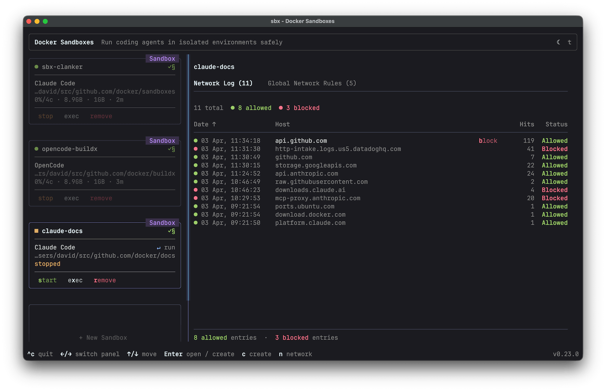



Docker Sandboxes run AI coding agents in isolated microVM sandboxes. Each
sandbox gets its own Docker daemon, filesystem, and network — the agent can
build containers, install packages, and modify files without touching your host
system.

This page walks through a typical first session: installing the CLI,
authenticating your agent, running a sandbox, working with branches, and
cleaning up.

## Prerequisites

- macOS (Apple silicon), Windows (x86_64, Windows 11 required), or Linux
  (Ubuntu 22.04 or later, x86_64)
- If you're on Windows, enable Windows Hypervisor Platform. Open an elevated
  PowerShell prompt (Run as Administrator) and run:
  ```powershell
  Enable-WindowsOptionalFeature -Online -FeatureName HypervisorPlatform -All
  ```
- If you're on Linux, your user must be in the `kvm` group for hardware
  virtualization access.
- An API key or authentication method for the agent you want to use. Most
  agents require an API key for their model provider (Anthropic, OpenAI,
  Google, and others). See the [agent pages](agents/) for provider-specific
  instructions.

Docker Desktop is not required to use `sbx`.

## Install and sign in




```console
$ brew install docker/tap/sbx
$ sbx login
```




```powershell
> winget install -h Docker.sbx
> sbx login
```




```console
$ curl -fsSL https://get.docker.com | sudo REPO_ONLY=1 sh
$ sudo apt-get install docker-sbx
$ sudo usermod -aG kvm $USER
$ newgrp kvm
$ sbx login
```

The first command adds Docker's `apt` repository to your system. The
`usermod` command grants your user access to `/dev/kvm` for hardware
virtualization. You need to log out and back in (or use `newgrp`) for the
group change to take effect.




If you need to install `sbx` manually, download a binary directly from the
[sbx-releases](https://github.com/docker/sbx-releases/releases) repository.

`sbx login` opens a browser for Docker OAuth. On first login (and after `sbx
policy reset`), the CLI prompts you to choose a default network policy for your
sandboxes:

```plaintext
Choose a default network policy:

     1. Open         — All network traffic allowed, no restrictions.
     2. Balanced     — Default deny, with common dev sites allowed.
     3. Locked Down  — All network traffic blocked unless you allow it.

Use ↑/↓ to navigate, Enter to select, or press 1–3.
```

**Balanced** is a good starting point — it permits traffic to common
development services while blocking everything else. You can adjust individual
rules later. See [Policies](security/policy.md) for a full description of each
option.

> [!NOTE]
> See the [FAQ](faq.md) for details on why sign-in is required and what
> happens with your data.

## Authenticate your agent

Agents need credentials for their model provider. How you provide them depends
on the agent.

For Claude Code with a Claude subscription (Max, Team, or Enterprise), no
upfront setup is needed — use the `/login` command inside the sandbox to sign
in with OAuth. The session token stays on your host and is injected by a
proxy, not stored inside the sandbox.

For agents that use API keys (or if you prefer API key authentication for
Claude Code), store the key before starting a sandbox:

```console
$ sbx secret set -g anthropic
```

This prompts for the secret value and stores it in your OS keychain. A proxy on
your host injects the key into outbound API requests so it's never exposed
inside the sandbox. See [Credentials](security/credentials.md) for details on
scoping, supported services, and alternative methods.

To give the agent access to GitHub for creating pull requests or interacting
with repositories:

```console
$ sbx secret set -g github -t "$(gh auth token)"
```

## Run your first sandbox

Pick a project directory and launch an agent with
[`sbx run`](/reference/cli/sbx/run/):

```console
$ cd ~/my-project
$ sbx run claude
```

Replace `claude` with the agent you want to use — see [Agents](agents/) for the
full list.

The first run takes a little longer while the agent image is pulled. Subsequent
runs reuse the cached image and start in seconds.

You can check what's running at any time:

```console
$ sbx ls
SANDBOX              AGENT    STATUS    PORTS   WORKSPACE
claude-my-project    claude   running           ~/my-project
```

You can also run `sbx` with no arguments to open an interactive dashboard.
The dashboard shows your sandboxes with live status, lets you attach to
agents, open shells, and manage network rules from one place. See
[Interactive mode](usage.md#interactive-mode) for details.



## Use branch mode

By default, the agent edits your working tree directly. To give it its own
Git branch, use `--branch`:

```console
$ sbx run claude --branch my-feature
```

This creates a [Git worktree](https://git-scm.com/docs/git-worktree) under
`.sbx/` in your repository root. The agent works on its own branch and
directory without touching your main working tree.

When the session ends, review what the agent did from the worktree:

```console
$ cd .sbx/<sandbox-name>-worktrees/my-feature
$ git log
$ git diff main
```

If you're satisfied, push the branch and open a pull request:

```console
$ git push -u origin my-feature
$ gh pr create
```

Branch mode is especially useful when running multiple agents on the same
repository — each gets its own branch and can't overwrite the other's changes.
See [Branch mode](usage.md#branch-mode) for more options, including
`--branch auto` and multiple branches per sandbox.

## Manage network access

Your network policy controls what the sandbox can reach. If the agent fails to
connect to an API or service, it's likely blocked by the policy.

Check which rules are in effect:

```console
$ sbx policy ls
```

To allow a specific host:

```console
$ sbx policy allow network registry.npmjs.org
```

With **Locked Down**, even your model provider API is blocked unless you
explicitly allow it. With **Balanced**, common development services are
permitted by default. See [Policies](security/policy.md) for the full rule
set and how to customize it.

## Clean up

Sandboxes persist after the agent exits. To stop a sandbox without deleting it:

```console
$ sbx stop my-sandbox
```

Installed packages, Docker images, and configuration changes are preserved
across restarts. When you're done with a sandbox, remove it to reclaim disk
space:

```console
$ sbx rm my-sandbox
```

Removing a sandbox deletes everything inside it — installed packages, Docker
images, and any branch mode worktrees under `.sbx/`. Files in your main
working tree are unaffected.

## Next steps

- [Usage guide](usage.md) — sandbox management, reconnecting, multiple
  workspaces, port forwarding, and more
- [Agents](agents/) — supported agents and configuration
- [Custom environments](agents/custom-environments.md) — build your own sandbox
  images
- [Credentials](security/credentials.md) — credential storage and management
- [Workspace trust](security/workspace.md) — review agent changes safely
- [Policies](security/policy.md) — control outbound access
